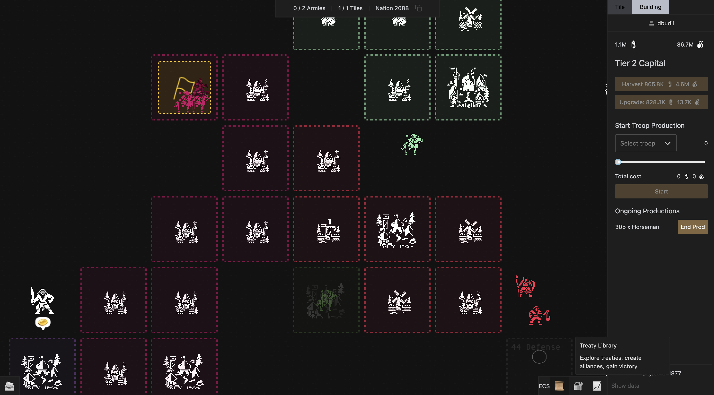

# Treaty V0

Treaty is a fully on-chain 4X strategy game. In Treaty, players are able to express and enforce social contracts (i.e. treaties) through code. This repository contains the core smart contracts and tests for game.

For more details, see [Treaty Technical Overview](https://blog.curio.gg/how-we-built-this-treaty-technical-overview/) from our blog.

## Codebase structure

- `contracts` directory contains game smart contracts using the [Diamond](https://eips.ethereum.org/EIPS/eip-2535) standard.
- `tasks` directory contains game constants, map generation, and deployment-related code.
- `test` directory contains tests for contracts using [Foundry](https://github.com/foundry-rs/foundry).

## How to use

### Setup

To use, first follow the following steps:

1. Install Foundry, a modular toolkit for Ethereum applications, [here](https://getfoundry.sh/).

2. Clone this codebase.

3. Run `yarn install` to install dependencies.

4. Run `git submodule update --init --recursive` to install all submodules.

### Local deployment and test

Then, to deploy the contracts locally:

1. Adjust parameters in `tasks/constants.ts`.

2. Spin up a local network using `npx hardhat node`.

3. In a separate terminal, deploy using `npx hardhat deploy`.

To run Foundry tests, simply run `yarn ft`.

### Contribution

Creating your own treaty is simple! Go to `contracts/treaties` folder and create `MyTreaty.sol`:

    //SPDX-License-Identifier: MIT
    pragma solidity ^0.8.13;

    import {CurioTreaty} from "contracts/standards/CurioTreaty.sol";
    import {CurioERC20} from "contracts/standards/CurioERC20.sol";

    contract MyTreaty is CurioTreaty {
        ...
    }

We will soon add more support for you to use your custom treaties in game or to improve the core contracts. For now, join our [Discord](https://discord.gg/qDeQUDe6) to discuss new features, treaties, or changes.

## About Curio

Curio Research is an on-chain gaming lab. Visit our [website](https://curio.gg) and [Twitter](https://twitter.com/0xcurio) for more information about us.

Join our [Discord](https://discord.gg/qDeQUDe6) to get support and connect with the community!

## Licensing

Treaty is licensed under [MIT](LICENSE).
